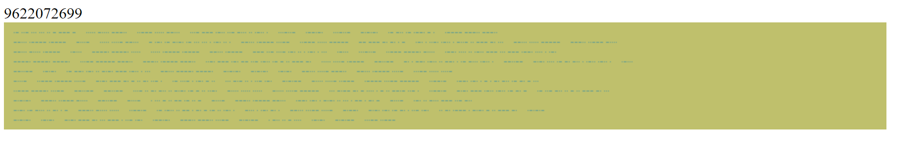

# CaptainMacTusk
### 499 | Difficile

le Captain MacTusk prévoit une attaque imminente.A vous de décoder le message le plus rapidement possible en mettant en relation les deux informations données. Lien pour le message :

https://capitainmactusk.flag4all.sh/index.php
Et renvoyer la réponse ici :

https://capitainmactusk.flag4all.sh/index.php/index.php?rep= ( au format md5) Le tout en moins de 2s.

Auteur : Zancrows (BZHack)

#### Output :

#### Réflexion :
La page nous affiche deux choses. Un nombre ainsi qu'une image contenant ce qui semble être du code morse.
Le but est de s'occuper d'abord du code morse puis de finir par trouver le lien entre les deux.

#### Solution :
Pour le code morse je suis parti d'un lecteur de morse dans une image : https://github.com/eauxfolles/morse-ocr
J'ai modifié le début du code afin de récupére les deux informations (nombre + image)
En regardant l'image je remarque que les éléments sont regroupés par "mots". Chaque ligne comporte toujours le même nombre de mot et l'image contient toujours le même nombre de ligne.
Je suis alors parti du principe que les 10 chiffres donnés plus haut correspondent au mot de chaque ligne qu'il faut transformer.
Certains caractère du script de base n'arrivent pas à être traduits je les remplacent alors par un caractère random "µ" afin de ne pas planter le script.
Une fois la traduction de chaque ligne obtenu il suffit de récupérer les bons mots de chaque ligne via le nombre fourni. 

De transformer ce dernier en md5 !!! (L'info n'était pas présente au début du chall et m'a fait louper le first blood à 20mn... ;( )

Et enfin d'envoyer le résultat à l'adresse : https://capitainmactusk.flag4all.sh/index.php/index.php?rep= On obtient alors le flag :
FLAG{UnMorse-avise-en.vaut.deux}

